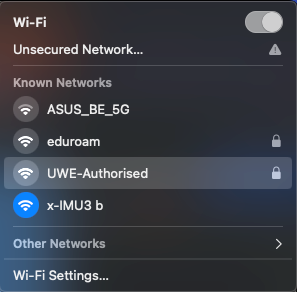
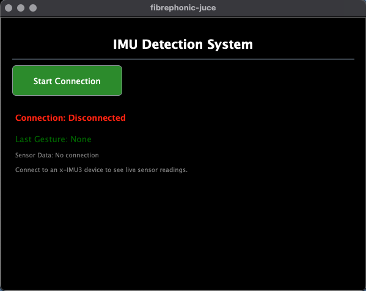
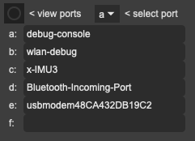
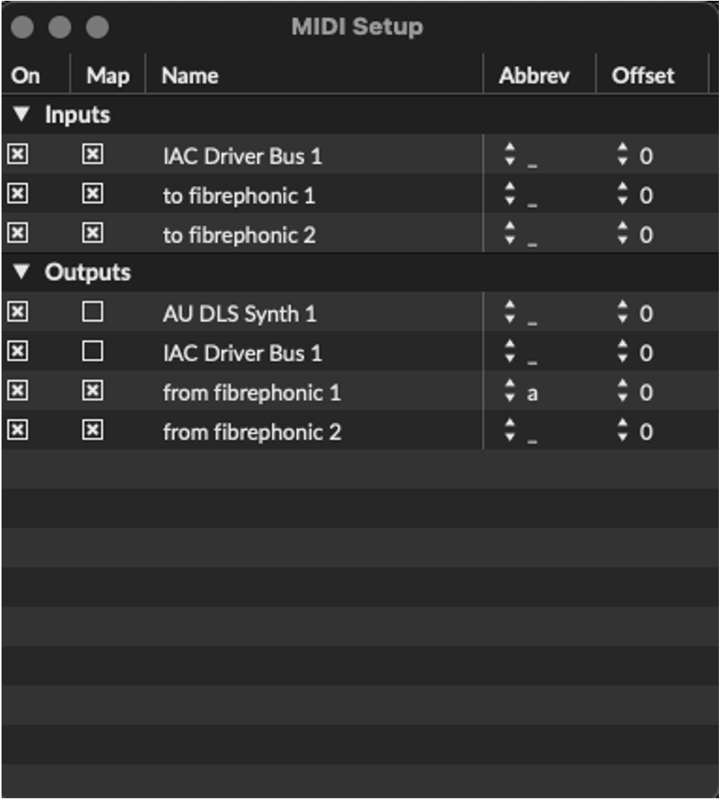

# music and textiles workshop study
Setup of the study system is different depending on your operating system. You will need: an x-IMU3, both data gloves (nfc & touch), the serial data collector, and a DAW installed.

## setup guide
### mac
You will need:
- An installation of Max: https://cycling74.com/downloads
- The study max patch (included in files as 'sensor-full-project')
- The IMU data bridge (included in files as 'imu-bridge-mac.zip')

#### 1. Run **imu-bridge**...
- Switch on the x-IMU3 (it should have a purple light).
- Connect to the x-IMU3 through the WiFi settings on your device.

  
- Press ‘Start Connection’ on the GUI.

  
- The LED should strobe white for a short while, and the numbers on the GUI should update rapidly.

#### 2. Open **sensor-full-project**...
- Follow the on-screen prompts to locate the relevant serial port and select it from the drop-down menu.

- Check your MIDI settings, ensuring that the MIDI port ‘from max-patch 1’ is mapped to ‘a’.

- If working, you will be able to scan and set nfc tags, and see a data stream coming in.

#### 3. Open your **DAW**...
- Check that 'from max-patch 1' had the relevant access in the MIDI settings.

### windows
You will need:
- An installation of Max: https://cycling74.com/downloads
- The study max patch (included in files as 'sensor-full-project')
- The IMU data bridge (included in files as 'imu-bridge-windows.zip')
- A virtual MIDI port: https://www.nerds.de/en/loopbe1.html (*others are available*)
- A serial port monitor: https://www.com-port-monitoring.com/downloads.html

#### 1. Run **imu-bridge**...
- Switch on the x-IMU3 (it should have a purple light).
- Connect to the x-IMU3 through the WiFi settings on your device.
- Press ‘Start Connection’ on the GUI.
- The LED should strobe white for a short while, and the numbers on the GUI should update rapidly.

#### 2. Open your **virtual MIDI port**...
- Follow the developer's instructions to open a virtual loopback port and give it an indentifiable name.
- This only needs to be done once, but the MIDI port needs to be reopened each time the system is used.

#### 3. Open your **serial port monitor**...
- Locate the serial/COM port of the fibrephonic serial data collector.
- Begin monitoring this port, checking for a stream of numbers coming in.
- Once this has been identified, stop monitoring the port and close the application. 
- This needs to be done each time the system is used, before running the Max project.

#### 4. Open **sensor-full-project**...
- Follow the on-screen prompts to locate the relevant serial port and select it from the drop-down menu.
- Check your MIDI settings, ensuring that the virtual MIDI port is mapped to ‘a’.
- If working, you will be able to scan and set nfc tags, and see a data stream coming in.

#### 5. Open your **DAW**...
- Check that your virtual MIDI port had the relevant access in the MIDI settings.
